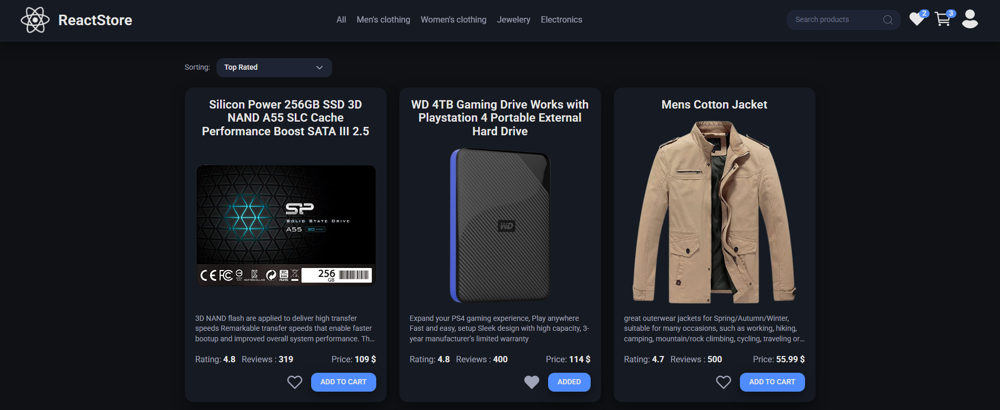
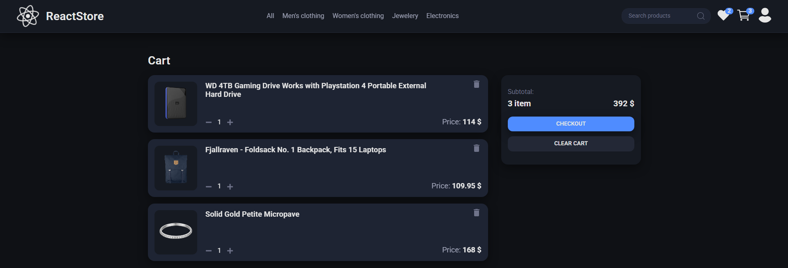
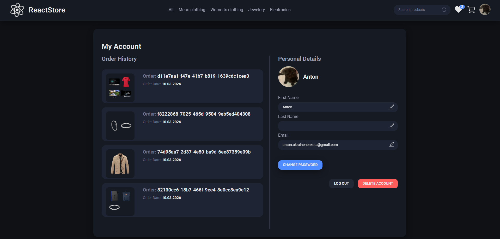

# Simple Store


[Description](#description) • [Features](#features) • [Installation](#installation) • [Screenshots](#screenshots)

## Description

This project is a simple e-commerce frontend built with React and TypeScript.
Users can browse products, filter them, add them to the cart, place orders, and manage their profile.

The application fetches product data from an external [API](https://fakestoreapi.com/) and demonstrates
state management, routing, and UI architecture in a modern React application.

## Features

- Browse products from API
- Filter products by category, name, price, and rating
- Add and remove items from cart
- Add and remove itesm from favorites
- Place orders
- User profile with order history
- Change user avatar
- Persistent cart using localStorage

## Installation

Clone the repository

```bash
git clone https://github.com/Woefulking/Simple-store.git
cd Simple-store
```

Install dependencies

```bash
npm install
```

Run the project

```bash
npm start
```

## Screenshots

### Products



## Cart



## Profile


